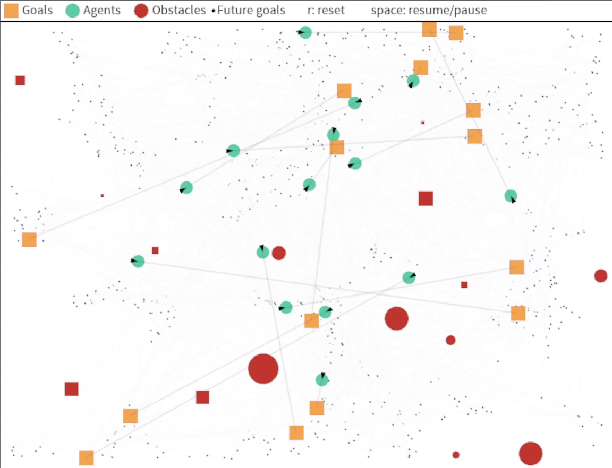

# CSCI 5611: Project 2
Sarh Boelter and Ebasa Temesgen
## Simulation Images

[Link to image if image render doesn't work](https://drive.google.com/file/d/1E4QHEb0g1XGHctcMrsHKCAT4x7TE8Afi/view?usp=sharing)

[Link to image if image render doesn't work](https://drive.google.com/file/d/1DPNCxqSfVNAigiLj9vBzSBYSPvBlGnMS/view?usp=sharing)

## Features with Video and Descriptions

Instructions for running simulations are located in gitHub readme in linked code below.

### Cloth
<iframe width="560" height="315" src="https://www.youtube.com/embed/gZQtXxkmfhg?si=qElGS82LpZJ9Dikd" title="YouTube video player" frameborder="0" allow="accelerometer; autoplay; clipboard-write; encrypted-media; gyroscope; picture-in-picture; web-share" allowfullscreen></iframe>

<iframe width="560" height="315" src="https://www.youtube.com/shorts/WignRsKkIOM" title="YouTube video player" frameborder="0" allow="accelerometer; autoplay; clipboard-write; encrypted-media; gyroscope; picture-in-picture; web-share" allowfullscreen></iframe>

Part 1 simulates a 3D dynamic system involving a set of interconnected nodes (resembling a net or a piece of cloth) that interact with a movable spherical obstacle. The simulation leverages physical principles like gravitational force, spring forces, and damping. It includes 3D Visualization using Processing's P3D renderer for 3D graphics, Camera Controlsto navigate through the simulation scene using a flexible camera control, interactive obstacles by the obstacle with your mouse and have it interact with the nodes. 

#### Physics Behind the Simulation

The core physics simulation is based on: 
* Gravity: Each node in the ropes experiences gravitational force.
* Spring Forces: The forces between interconnected nodes simulate springs. The spring forces are calculated based on Hooke's Law, 
* Damping: A damping force is applied to reduce oscillations and stabilize the system.
* Collision: The nodes interact with the floor and the spherical obstacle through collision detection and response.

Key Functions:
* applyGravityToNodes(): Applies gravitational force to all nodes.
* computeForcesBetweenNeighbors(): Computes spring and damping forces between adjacent nodes.
* computeForceBetweenNodes(): Calculates forces between a pair of nodes.
* updateNodesUsingEulerIntegration(): Updates node positions and velocities using the Euler integration method.
*handleFloorAndObstacleCollisions(): Detects and handles collisions between nodes, the floor, and the obstacle.

#### Attempted Point Breakdown and Timestamps

Video 1
* Cloth Simulation - 65 Points - Throughout Video, obstacle interaction 2-4 seconds.
* 3D Simuation - 10 Points - Throughout Video
* High Quality Rendering- 5 Points -Throughout Video
* Self Collisions - 10 Points 4-8 seconds with rippling

Video 2
* High Quality Rendering (Camera)- 5 Points -Throughout Video

### SPH Fluid Simulation
<iframe width="560" height="315" src="https://www.youtube.com/embed/IKPuJWKERDY?si=KBbrufAoDlz34LIs" title="YouTube video player" frameborder="0" allow="accelerometer; autoplay; clipboard-write; encrypted-media; gyroscope; picture-in-picture; web-share" allowfullscreen></iframe>

Part 2 simmulates SPH Fluid Simmulation in a larger scene interacting with a beachball. Beachball floats and bounces in the top layer of water, showing it's difference in denisty from the water. This simmulation takes particles and applies physics to have them move simmilarly to water. This simulation is based loosly on the SPH/lagrangian fluid simulation linked from Canvas. 

#### Physics Behind the Simulation
* Density: each particle has local density calculated based on its distance to other neighboring particles.
* Pressue: Pressure for each particle is calculated based on local density and overall SPH denisty.  This is Clavet's approach.

#### Attempted Point Breakdown

* SPH Fluid Simulation - 30 points - Bouncing ball and water can be found in the entire video

## Writeup
We ran into some issues early on with a very node-based simulation simmilar to the swinging rope.  We tried to get it to work but ran into too many collisions causing the cloth to go all over the place.  We were eventually able to get a 3D rendering working correctly. 

We ran into some difficulties getting the density and the near-neighbor pressure to work correctly, but eventualyl we got a simulation that looks somewhat real to water. We were able to get a beachball simulated on the top of the waves as well.  We didn't want to have a user ineraction with the water because it was a beach scene, so to get "waves" going, we have the particles populating from above and landing in the begining, creating the simulation of waves.

## Code Location
[Link to code repository for Cloth and SPH Fluid Simulation](https://github.com/seboelter/Animation-in-Games-Project-2).

## Libraries and Tools
* PImage
* Clipart images.  Links cited in top of Fluid.pde
* Camera System from Canvas written by Liam Tyler
* Vec2 Library from In-Class Exercises

## Art Contest

[Link to image if image render doesn't work](https://drive.google.com/file/d/1E4QHEb0g1XGHctcMrsHKCAT4x7TE8Afi/view?usp=sharing)

[Link to image if image render doesn't work](https://drive.google.com/file/d/1DPNCxqSfVNAigiLj9vBzSBYSPvBlGnMS/view?usp=sharing)

