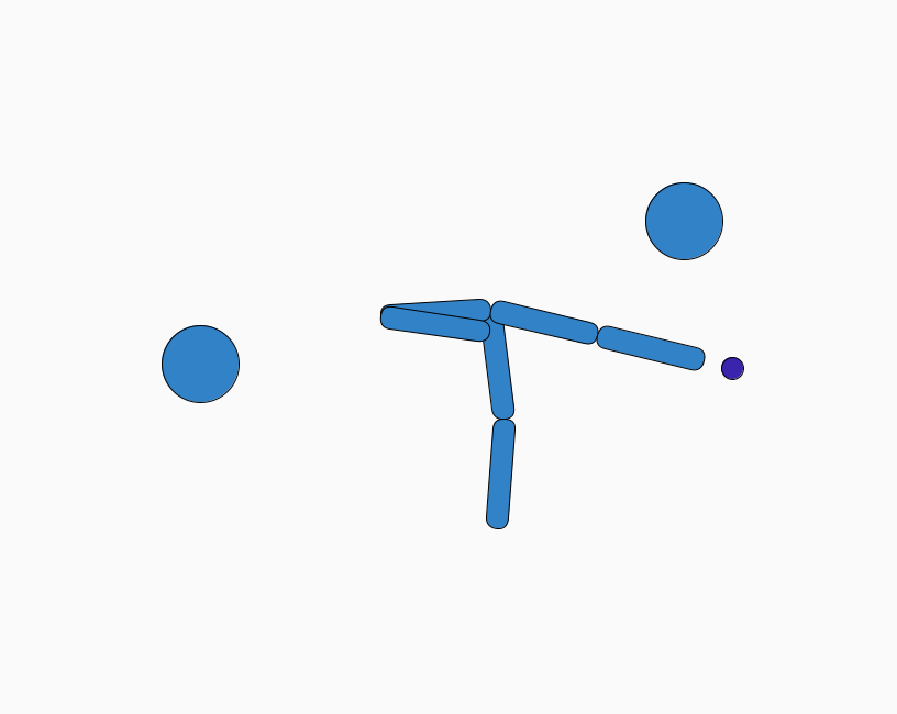

# CSCI 5611: Project 3
Sarah Boelter and Simanta Barman
## Simulation Images

## Features with Video and Descriptions

Instructions for running simulations are located in gitHub readme in linked code below.

### Part 1: IK

#### Video 1
[Link to Video 1 if it doesn't render](https://www.youtube.com/embed/nQbxULdwHLg?si=wxOr16OzgcQNV0X6)
<iframe width="560" height="315" src="https://www.youtube.com/embed/nQbxULdwHLg?si=wxOr16OzgcQNV0X6" title="YouTube video player" frameborder="0" allow="accelerometer; autoplay; clipboard-write; encrypted-media; gyroscope; picture-in-picture; web-share" allowfullscreen></iframe>

#### Video 2
[Link to Video 2 if it doesn't render](https://www.youtube.com/embed/sYhF_HGZLv0?si=WjgDNno71lfsZW9R)
<!-- <iframe width="560" height="315" src="https://www.youtube.com/shorts/WignRsKkIOM" title="YouTube video player" frameborder="0" allow="accelerometer; autoplay; clipboard-write; encrypted-media; gyroscope; picture-in-picture; web-share" allowfullscreen></iframe> -->
<iframe width="560" height="315" src="https://www.youtube.com/embed/sYhF_HGZLv0?si=WjgDNno71lfsZW9R" title="YouTube video player" frameborder="0" allow="accelerometer; autoplay; clipboard-write; encrypted-media; gyroscope; picture-in-picture; web-share" allowfullscreen></iframe>

#### Description of Simulation and Key Functions

The skeleton is made up of a shoulder joint that is rooted in the ground. The shoulder joint is connected to an elbow joint which is connected to two wrist joints. Each wrist joint is connected to a separate end effector. Both end effectors orient themselves to point at the mouse cursor and try to follow it. Changing the orientation of the end effector and following the mouse cursor is done by using the inverse kinematics algorithm.

Each segment of the skeleton has a predefined length, an initial angle (from the horizontal or x axis) and a starting position. The starting position or the root of the skeleton is stored as a vector and represents the shoulder joint. Knowing the root position, the length (l) and the angle of the segment theta connecting the shoulder joint to the elbow joint allows us to calculate the position of the elbow joint. Projecting the length of the segment l onto the x and y axis gives us l * cos(theta) and y = l * sin(theta) respectively. To obtain the position of the elbow
joint we simply add projections to x and y coordinates of the root position. In other words, the elbow joint is located at (x + l * cos(theta), y + l * sin(theta)). Using this equation we updated the elbow joint. Now since the elbow joint is connected with the wrist joint by another segment and we updated the position of the elbow joint, we need to use the new position of the elbow joint to calculate the position of the wrist joint. 

Initially, the segment connecting the elbow and one of the wrist joints created theta_1 angle with the horizontal axis. Since we changed the position of the elbow joint from it's initial position, the angle theta_1 is no longer valid. To obtain the new angle we add angles from all the previous segments to theta_1. In this case, theta_1' = theta_1 + theta. Similarly, we
can calculate the next end-point of the current segment. This process of computing the new angle and using the length of the segment to calculate the new position of the end point is repeated until the end effecter is updated. This is known as forward kinematics.

The end effector following the mouse cursor results in changing the coordinates of the end effector. This changes the angle created by the segment connecting the wrist joint and the end effector. To obtain position of the end effector a vector can be created pointing from the start of this segment (wrist joint) to the cursor position. The vector can be calculated by subtracting the position of the wrist joint from the position of the cursor. To obtain the angle between the segment vector (pointing to the end effector) and the vector pointing to the cursor both from the wrist joint, we use the dot product of the two vectors. Before taking the dot product we normalize both vectors. We also clamp the dot product between -1 and 1 to ensure that the arc cosine function is not evaluated with values for which it is undefined. Then taking the arc cosine of the dot product gives us the angle between the two vectors. Then based on the sign of the cross product of the two vectors we add or subtract the angle from the current angle of the segment. This updates the angle of the segment connecting the wrist joint and the end effector. This process is then propagated backwards to update the angles of all the previous segments. This is known as inverse kinematics.

To ensure collision occurs between the segments of the skeleton and the obstacles, we use the line segment and circle intersection test using Continuous Collision Detection (CCD). The line segment is created by connecting the start and end points of the segment. The circle is created using the radius of the obstacle. Since the segments of the skeleton does have width, we increase the radius of the circle by half of that width to ensure that we can treat the segment as a line. Then collision is checked between the line segment and the circle. If a collision is detected then the angle is
rolled back to the previous angle and incremental changes to the angle is made until collision. Note that rolling back to a previous angle requires going back to a previous state for the entire skeleton. For this, we need to use forward kinematics after changing the angles of the segments to ensure the segment end-points are updated correctly.

#### Attempted Point Breakdown and Timestamps

Video 1
* Single-Arm IK - 20 Points - Throughout video
* Multi-Arm IK - 20 Points - Throughout video - Base rotates back and forth for two arms, root stays stationary, joint limits are imposed in a way that makes sense for the setup, when the arm touches the ball, it changes colors in a rainbow.
* Joint Limits - 20 points - Throughout video, this video shows joint limits implemented on limbs
* User Interaction - 10 Points - Throughout video - Arm chases a ball on the screen.

Video 2
* IK Obstacles - 20 Points - Throughout video - Arms cannot make it through obstacles to get to the ball, they do not stick. 
* Joint Limits - 20 Points - This video shows the arms without imposed joint limits.

### Part 2: Crowd Simmulation
<iframe width="560" height="315" src="https://www.youtube.com/embed/Bh0Di3qIXho?si=mqgqybK1UU-5q_sx" title="YouTube video player" frameborder="0" allow="accelerometer; autoplay; clipboard-write; encrypted-media; gyroscope; picture-in-picture; web-share" allowfullscreen></iframe>

#### Description of Simulation and Key Functions
Full crowd simulation:
A variant of the multi-agent path finding problem (MAPF) is considered. The problem is to plan paths for a set of agents to a set of assigned goals while avoiding collisions. The environment is shared and therefore in addition to the static obstacles in the environment, the agents themselves act as dynamic obstacles. The agents are assigned a set of goals and once an agent reaches its current goal, a new goal is spawned in the environment and assigned to the agent. Each agent want to move to their current goal while avoiding static and dynamic collisions.

Motion planning using probabilistic roadmap (PRM):
First, the environment was created by placing random static obstacles. First, we generated all the circular obstacles. The first obstacle with a random radius was just placed in a random position inside the environment boundary. For the second obstacle, a random position and a radius were generated. Then whether the second circular obstacle intersected the first obstacle was checked. If no collision was detected then that obstacle was placed in the environment otherwise a new random position and radius were generated and this process was repeated until a valid obstacle was found. The same
procedure was used to generate all the other circular obstacles. Then the rectangular obstacles were generated.

Similarly, for a random rectangle all the other obstacles were checked for collision. If no collision was detected then the rectangle was placed in the environment. Otherwise, a new random rectangle was generated and this process was repeated. The agents' initial positions were also generated this way. For each agent, a set of random goals that did not intersect with any of the obstacles were generated. Then for each agent, a probabilistic roadmap was generated. The generation of the probabilistic roadmap is very similar. First, a set of points that did not intersect with any of the obstacles was generated. These points were used as the vertices of the PRM graph. The initial position of an agent and its goal position were also added to the set of vertices for the PRM graph for that agent. After that for each agent's PRM graph, the edges were connected. To connect the edges for a PRM graph, for each vertex in the set of vertices all other vertices that were less than 200 pixels away were considered.

For a pair of vertices if the line segment connecting the two vertices did not intersect with any of the obstacles then the two vertices were connected and an edge in the PRM graph was created. This process was repeated for all the vertices to construct the PRM graph. Using this PRM graph, performing breadth-first-search (BFS) from the agent's initial position to the goal position can be used to find a path for the agent to reach its goal.

The BFS algorithm first marks all the vertices as unvisited and sets the parent node of all the vertices to -1. Then the first node or the agent's initial position is marked as visited and added to the fringe queue. Then until the goal node is found, the fringe queue is popped and the neighbors of the popped node are added to the fringe queue. The
neighbor nodes' parent is then updated to the current node and then they are marked as visited. After the fringe is empty, using the parent node information starting from the goal node, the path from the agent's initial position to the goal can be constructed.

Another way to find a path from the agent's initial position or the starting node to the goal node is just finding a random node in the PRM and then if the line segment connecting the starting node and the random node does not intersect any obstacle then add the random node to the path. Before adding the random node the path contained only the start node.
After adding the random node, the last node in the path is the random node. Now the same process is repeated for finding another node in the PRM graph. When the path is of a certain length or when the random node is very close to the goal node, this process can be terminated to obtain a path from the start node to the goal node. Since we had to spawn new
goals for the agents, we used this method. To demonstrate collision avoidance behavior we also skipped the ray intersection test before adding a random node to the path. This will be described further in the collision avoidance section. However, a complete BFS implementation to find a path in a PRM (taken from the class exercise) is included in
our code. Furthermore, if moving an obstacle causes certain edges to be invalid in the PRM graph, then we also have code to fix and rebuild the PRM graph efficiently. The way this is implemented is by checking if any node intersects with the moving obstacle. If a node does intersect, then the node and the edges connected to the node are deleted from the PRM and a new valid node is added to the PRM graph with edges connecting it to neighboring nodes.

Collision avoidance using time-to-collision (TTC) forces:
For collision avoidance, we used the time-to-collision (TTC) forces. First, a sensing radius is defined for the agents. For each agent, we found all the agents that were less than this sensing radius away. In other words, we found all the neighboring agents within the sensing radius for each agent and stored them. Each agent has their own position, velocity and acceleration vectors. To move the agent we used Eulerian numerical integration: we first updated the velocity of each agent by adding acceleration vectors times time step to the velocity. Then we used the updated velocity and multiplied it with timestep and added it to the position vector. This updated the position of the agent. Before updating the positions of the agents we calculated the forces applied to each agent. The forces to be applied to each agent were stored as the acceleration at the previous time step. During the calculation of the forces, we considered the forces
that would move the agents toward their goals and repel the agents from obstacles. To move an agent forward towards its goal we calculated the direction vector from the agent's current position to its goal position. This direction vector was used as the velocity vector for the agent after restricting the magnitude of the vector to the maximum predefined speed of the agent. Then the acceleration vector was calculated by subtracting the current velocity vector multiplied by a constant representing goal-seeking behavior, from this goal velocity vector.

Very small goal velocity represents that the agent is already at the goal position. If an agent is not at their goal position then for all neighboring agents within the sensing radius future collisions are checked. To check for future collisions, the time-to-collision (TTC) is calculated. There will be a collision at time t when the distance between the two agents is exactly equal to the sum of their radii, |(x_B + v_B tau) - (x_A + v_A tau)| = r_A + r_B. Squaring and expanding this equation results in (v.v)tau^2 + 2(w.v)tau + w.w - (r_A + r_B)^2 = 0 where w = x_B - x_A and v = v_B - v_A. This equation now can be solved using the quadratic formula to obtain the time-to-collision. This operation is also similar to the ray circle intersection where the circle has the combined radius of both the agents' radii and the origin of the second agent and the ray has the same start as the current agent, the ray's direction is the relative velocity or the vector from the first agent to the second agent.
If there will be a collision in the future the tau would have a valid positive value. Now after calculating the time-to-collision, if a collision is predicted in the future then the agent's direction can be changed to avoid the collision. This can be done by adding a constant that represents the collision repulsion behavior, divided by the
time-to-collision to the vector from the current agent's future direction to the other agent's future direction. The relative future direction vector is first normalized before multiplying it with the collision repulsion constant divided by time-to-collision. This force is then added to the acceleration vector of the agent. This process is done for all the
agents to ensure that the agents avoid collisions with each other.

#### Attempted Point Breakdown
1. Complete Crowd Simulation - throughout the video
2. Motion Planning with PRM - throughout the video
3. Collision Avoidance with TTC - throughout the video
4. Orientation of the agents visualized - throughout the video
5. Resettable environment with changing target locations for agents - throughout the video

## Writeup

Getting the IK simmulation was actually both really straightforward and very difficult.  We got a 3D version working fairly quickly, but struggled implementing angles in the Z direction while keeping the simmulation looking nice.  We eventually switched back to the 2D version of IK, which was much easier to work with, but We struggled getting collisions to work correctly.  Initially we thought it was my collision function so we tried doing several different shapes to do a workaround.  Eventually we realized that we weren't setting the arm back to the previous state if there was a collision, and only the state that had made it collide in the first place. 

Using the TTC forces to avoid collisions required tuning the parameters a lot. Initially, the repulsion constant (k_avoid) was set to be lower than the goal-seeking (k_goal) constant. This resulted in the agents not avoiding each other at all and when they collided they would just disappear from the screen. Then reducing the k_goal resulted in
agents not being able to reach and stay at their goals. They would just keep moving around their goals. Increasing the k_goal further fixed this issue. Further, after reaching their goals the agents were coded to stop participating in adjusting their positions due to TTC forces. This also ensured that collision avoidance forces would not move an agent
after they reached their goals. For the other agents to ensure that with higher k_goal the agents still had proper collision avoidance, the k_avoid had to be increased again. The goal speed was also decreased to ensure that the agents did not move too fast. To avoid agents disappearing from the screen when they collided, circle-circle collision
resolution technique was used. This made things more stable, however, at that point the collision avoidance code was working decently so collisions were not happening that much anyway.

## Code Location
[Link to code repository for IK and Crowd Simmulation](https://github.com/seboelter/Project3).

## Libraries and Tools
* Vec2 Library from In-Class Exercises

## Art Contest

